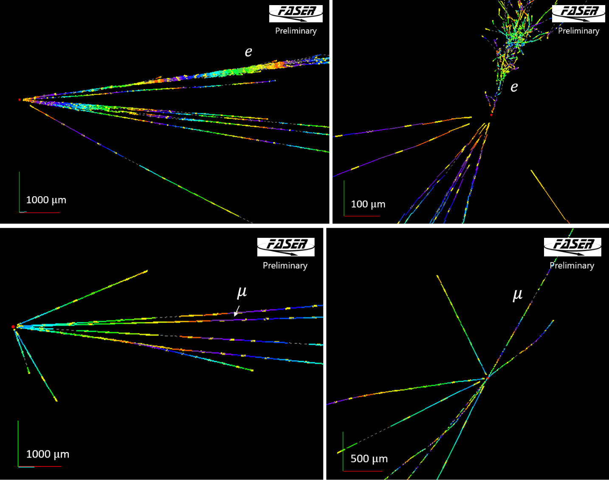

# Telling neutrinos apart from neutral hadrons in FASERnu

A starter project in data analysis and machine learning, using real simulated data from
the [FASER experiment](https://faser.web.cern.ch/) at CERN.

## The physics, briefly

FASER sits 480 m downstream of the ATLAS collision point at the LHC. Its neutrino
detector, **FASERnu**, is a stack of roughly 700 photographic films interleaved with
tungsten plates. Charged particles passing through leave tracks in the emulsion, which
are scanned and reconstructed in 3D.

When a neutrino strikes a tungsten nucleus it produces a spray of charged particles
starting from a single point. That point is a **vertex**; the particles coming out of it
are the **primary tracks**. Because the neutrino itself is electrically neutral, there is
no track leading *into* the vertex, it appears out of nowhere.

Examples of an electron neutrino interaction (top row, two different views) and a
muon neutrino interaction (bottom row) are shown below.



That last property is the problem. A **neutral hadron** (a neutron, $\Lambda$, 
or $K^0$) is also electrically neutral, also leaves no incoming track, and also produces a
spray of outgoing particles. These are produced in large numbers when muons from the LHC
interact inside the detector itself. Under a microscope the two look alike.

So every clue must come from the *outgoing* tracks: how many there are, how fast they
are, how they are arranged in space. That is what this dataset contains.

- **Signal**: a neutrino interaction
- **Background**: a neutral hadron interaction

Roughly speaking, in the real experiment the background outnumbers the signal about
8 to 1, which is what makes the problem worth solving.

## Getting started

### 1. Install Python and the packages

This project uses [uv](https://docs.astral.sh/uv/), which handles Python versions and
packages together. Install it with:

```bash
curl -LsSf https://astral.sh/uv/install.sh | sh     # macOS / Linux
```

Then, from the project folder:

```bash
uv sync
```

That creates a virtual environment in `.venv/` and installs everything. A **virtual
environment** is a private copy of Python for this project, so packages you install here
will not break anything else on your computer.

<details>
<summary>Without uv (plain Python and pip)</summary>

```bash
python3 -m venv .venv               # create the environment

source .venv/bin/activate           # activate it (macOS / Linux)
.venv\Scripts\activate              # activate it (Windows)

pip install pandas numpy matplotlib scikit-learn jupyter
```

You need to run the `activate` line again in every new terminal. You can tell it worked
because your prompt gains a `(.venv)` prefix.
</details>

### 2. Get the data

`data/vertices.csv` is about 60 MB and is **not stored in this repository**. 
Download it from https://cernbox.cern.ch/s/7NNF2rwlMRuJg4y and place it in the `data/` folder.

### 3. Open the notebook

```bash
uv run jupyter lab explore.ipynb
```

If you are familiar with code editors, you can also open `explore.ipynb` in VS Code or PyCharm.

Run the cells from top to bottom with <kbd>Shift</kbd>+<kbd>Enter</kbd>.

## The data

One row is one reconstructed vertex. 268 898 rows, 33 columns.

| rows | |
|---|---|
| `background` | 162 949 |
| `numuCC` | 65 375 |
| `NC` | 22 630 |
| `nueCC` | 17 356 |
| `nutauCC` | 588 |

`CC` means **charged current**: the neutrino turned into its charged partner (a muon for
`numuCC`, an electron for `nueCC`, a tau for `nutauCC`), which leaves a track. `NC` means
**neutral current**: the neutrino bounced off the nucleus and continued invisibly, so
there is no lepton track and these are the hardest neutrinos to identify.

**The goal is to find all the CC interactions, which are the `numuCC`, `nueCC`, and
`nutauCC` rows.**

### Columns

| column | unit | meaning |
|---|---|---|
| `interaction` | — | What really happened. The label. |
| `weight` | — | How many real interactions this one row represents, for 9.5 fb⁻¹ of LHC data. **Never use as a feature**, see below. |
| `n_vtrk` | count | Primary tracks at the vertex. |
| `n_vtrk_100mrad` | count | Primary tracks within 100 mrad of the beam direction. |
| `n_vtrk_ip5` | count | Primary tracks passing within 5 µm of the vertex. |
| `n_vtrk_ip5_100mrad` | count | Both of the above at once. |
| `slope_mean`, `slope_max`, `slope_std` | — | tanθ of the tracks relative to the beam: mean, largest, and spread. |
| `delta_phi_mean`, `delta_phi_max` | rad | How back-to-back the vertex is. Every track counts equally. |
| `delta_phi_p_mean`, `delta_phi_p_max` | rad | The same, but each track weighted by its transverse momentum. |
| `p_max`, `p_sum`, `p_mean` | GeV | Momentum of the tracks: largest, total, average. |
| `n_tracks_with_momentum` | count | How many tracks had a measurable momentum. |
| `npl_max` | count | Films crossed by the longest track. |
| `ip_pos_mean`, `ip_pos_max` | µm | How close the tracks extrapolate back to the vertex. |
| `n_kinks` | count | Tracks with a sudden change of direction. This is the signature of a particle decaying in flight. |
| `kink_angle_max` | rad | The largest such change of direction. |
| `e_em_max`, `e_em_sum` | GeV | Energy of the electromagnetic showers. |
| `dphi_unit` | rad | Angle between the leading track and the other tracks added together, every track counting equally. Near π means back-to-back. |
| `dphi_p` | rad | The same, but each other track weighted by its momentum (the larger of `Prec_vtrk` and `Prec_par`). |
| `r90` | count | Other tracks pointing more than 90° away from the leading track. |
| `a_sum` | — | Length of the sum of all tracks' unit directions: how much the tracks point the same way. |
| `pt_sum` | GeV | Length of the sum of energy × direction over all tracks: how well the transverse momentum balances. |
| `n_vtrk_ippos3um` | count | Tracks passing within 3 µm of the vertex. |
| `n_vtrk_nseg5` | count | Tracks seen in more than 5 films. |
| `leadtrk_slope` | — | tan θ of the leading track. |
| `leadtrk_pt` | GeV | Transverse momentum of the leading track, energy × slope. |

### Caveats

Read these before drawing conclusions.

- **`weight` gives away the answer.** It takes only nine values, and each belongs to
  exactly one class, because signal and background were simulated separately. A model
  given `weight` will score perfectly and have learned nothing. Use it only for scaling
  histograms to the real experiment.
- **A quarter to a third of tracks have no measured momentum.** Momentum is measured from
  how much a track scatters, which needs a long track. `n_tracks_with_momentum` records
  how many went into `p_mean`. Requiring *every* track to have one would be a mistake:
  it happens far more often in signal than background, so it would leak the answer too.
- **There are no vertex coordinates.** Signal and background were generated in different
  volumes, so position would identify the class outright.
- **`dphi_p` is missing when no other track has a momentum**: 0.6% of background rows
  and 1–4% of signal rows.
- **The two Δφ families use different tracks.** `delta_phi_*` uses every track;
  `delta_phi_p_*` uses only those with a measured momentum, and is missing entirely when
  fewer than two qualify (1.8% of rows).
- **Background has about twice the track multiplicity of signal.** This is the single
  strongest difference in the data. It is expected from the strong interaction being
  messier than the weak one, but how much of the gap is real physics and how much comes
  from the energies at which the neutral hadrons were simulated has not been checked.

## Documentation

- **pandas**: tables, `read_csv`, filtering, `groupby`: <https://pandas.pydata.org/docs/>
  - begin with [10 minutes to pandas](https://pandas.pydata.org/docs/user_guide/10min.html)
- **NumPy**: arrays and numerical maths: <https://numpy.org/doc/stable/>
  - begin with [the absolute basics for beginners](https://numpy.org/doc/stable/user/absolute_beginners.html)
- **Matplotlib**: plotting: <https://matplotlib.org/stable/>
  - the [pyplot tutorial](https://matplotlib.org/stable/tutorials/pyplot.html) and the
  [example gallery](https://matplotlib.org/stable/gallery/index.html)
- **scikit-learn**: machine learning: <https://scikit-learn.org/stable/>
  - begin with [an introduction to machine learning](https://scikit-learn.org/stable/tutorial/basic/tutorial.html)

## For maintainers

`convert_root_to_csv.py` builds `data/vertices.csv` from the FASERnu reconstruction ROOT
files in `data/`. It needs those files plus the truth parquet files from the
`faser-nutau` repository, and takes about 15 seconds.

```bash
uv run python convert_root_to_csv.py
```

It applies two cuts:

1. **Fiducial volume**: the Takubo zones in x/y, plates 7–626 in z. This equalises the
   generation volumes of the two classes; it keeps 79% of signal and 98% of background.
2. **Incoming neutrino energy ≥ 200 GeV**, signal only, from the truth files. See
   [ADR 0002](docs/adr/0002-clean-signal-by-incoming-energy.md).

`geometry.py` and `weights.py` are copied from
[`fasernu-event-selection`](https://gitlab.cern.ch/) — `geometry.py` verbatim, `weights.py`
with its `print()` calls removed. Keep them in sync rather than editing them here.

Vocabulary used throughout is defined in [CONTEXT.md](CONTEXT.md).
